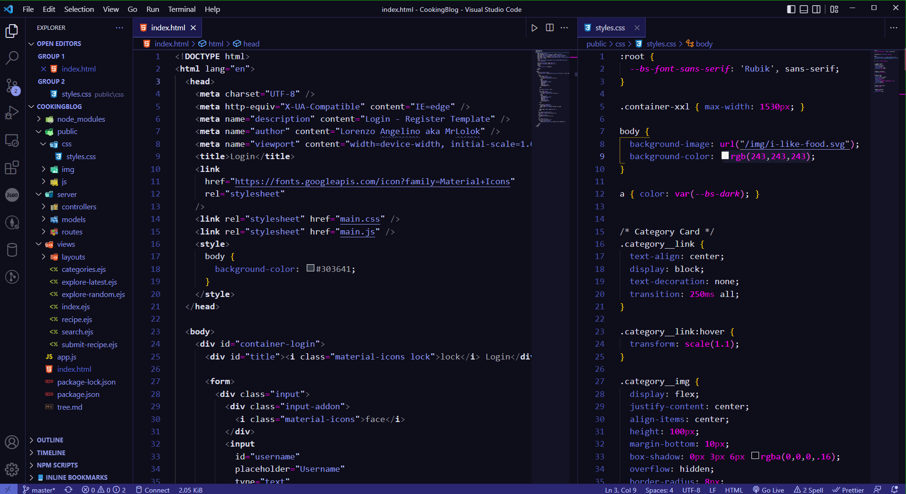
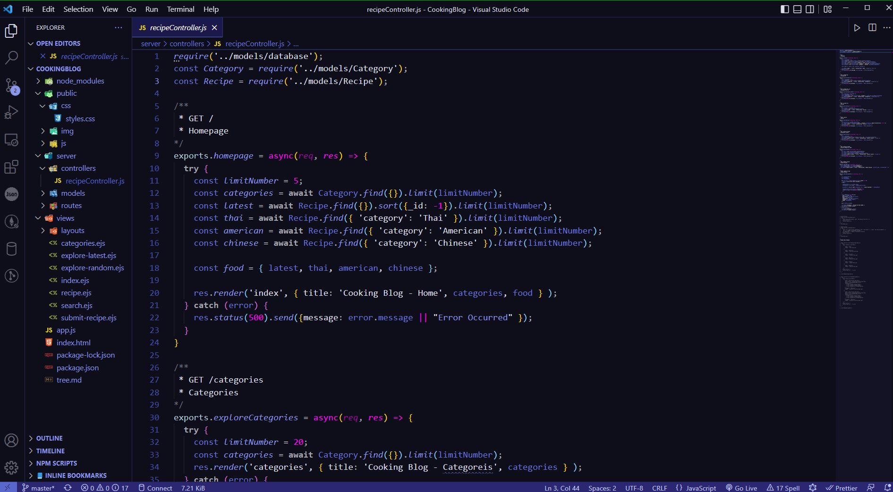
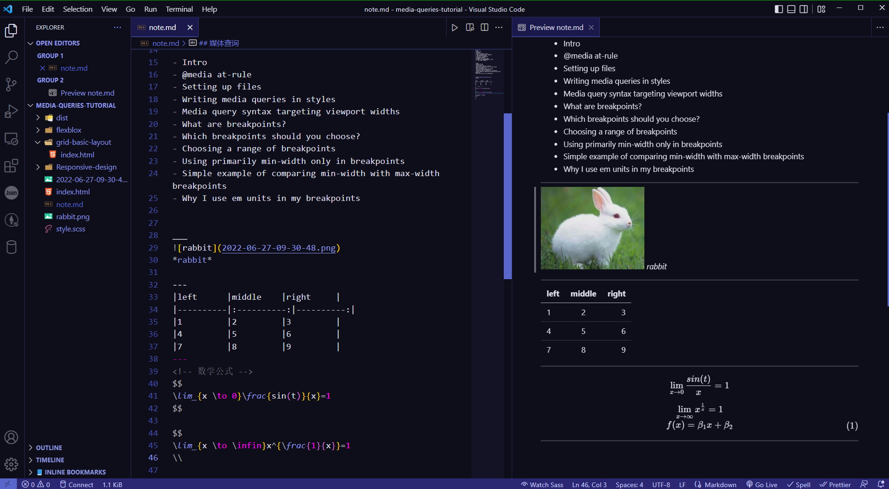

# Menon Dark Theme
> *This is my first time to develop vscode theme. I am a dark messenger, Aha:)*

## Installation
---
1. Open Extensions from the Activity Bar in VS Code. View → Extensions.
2. Search for Menon, choose "Menon Dark" by Menon Coder.
3. Click Install.
4. Navigate to File > Preferences > Color Theme > Menon Dark.

Or install from the command line(for menon-dark-theme-0.0.1.vsix):

*put the .vsix file into %VSCode_HOME%\bin directory,Open the command line in the current directory and execute the following command:*

`
 code --install-extension menon-dark-theme-0.0.1.vsix
`
 

## Screenshots
---
  
 
  
 
  
 

## License

[Apache-2.0 License](LICENSE)

 

_Copyright (c) 2022 Menon coder_

